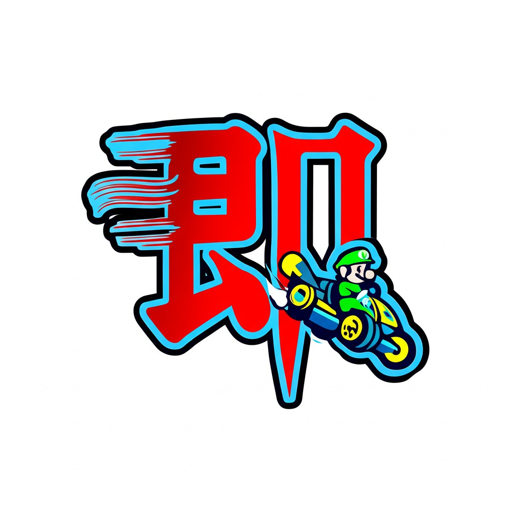
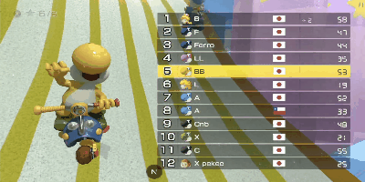
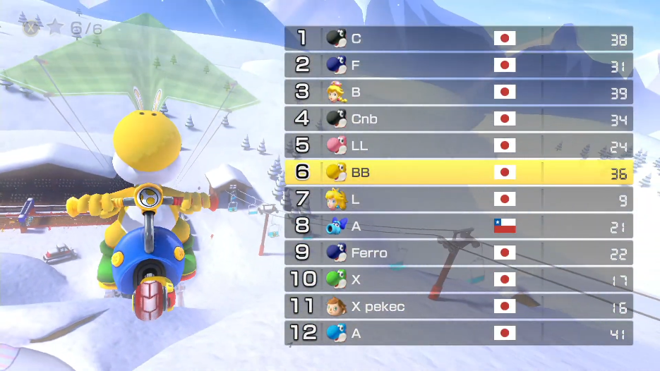
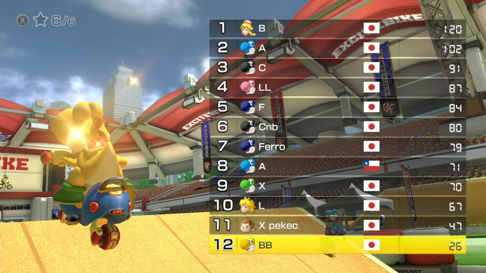

<div align="center">
  
  <h1></h1>
  <p><strong>マリオカート8デラックス レース結果自動取得・分析アプリケーション</strong></p>
  
  [](LICENSE)
  [](https://nextjs.org/)
  [](https://www.typescriptlang.org/)
  [](https://ai.google.dev/)
</div>

---



このプログラムは、マリオカート8デラックス（MK8DX）のレース結果を自動的に取得・分析し、チームスコアを管理するNext.jsアプリケーションです。
主にMK8DX 150cc Loungeでの使用を目的としています。

## 概要

### 主な機能
- **OBS WebSocketとの連携**: 配信画面からスクリーンショットを自動取得
- **AI画像解析**: Google Gemini APIを使用してレース結果画面を自動解析
- **チームスコア管理**: プレイヤーをチーム別に分類し、合計得点を自動計算
- **リアルタイム表示**: 配信オーバーレイとして使用可能なUI

### 技術スタック
- **フロントエンド**: Next.js 15、React 19、TypeScript
- **スタイリング**: Tailwind CSS、Framer Motion
- **AI分析**: Google Gemini Vision API
- **配信連携**: OBS WebSocket
- **状態管理**: React Hooks
- **フォーム管理**: React Hook Form

## セットアップ手順

### 1. 環境構築

```bash
# リポジトリをクローン
git clone <your-repository-url>
cd mk8dx-bot

# 依存関係をインストール
pnpm install

# 環境変数を設定
cp .env.example .env.local
```

### 2. 必要なAPI設定

#### Google Gemini API
1. [Google AI Studio](https://makersuite.google.com/app/apikey)でAPIキーを取得
2. `.env.local`に設定:
```env
GEMINI_API_KEY=your_gemini_api_key
```

#### OBS WebSocket設定
1. OBSで「ツール」→「WebSocketサーバー設定」を開く
2. WebSocketサーバーを有効化
3. 認証を設定し、`.env.local`に追加:
```env
# OBS WebSocket設定
OBS_IP=localhost
OBS_PASSWORD=your_obs_password
OBS_SOURCE_NAME=ウィンドウキャプチャ

# Google Gemini API
GEMINI_API_KEY=your_gemini_api_key
```

**OBS設定の詳細**:
- `OBS_IP`: OBSが動作しているPCのIPアドレス（同一PCの場合は `localhost`）
- `OBS_PASSWORD`: OBS WebSocketサーバーで設定したパスワード
- `OBS_SOURCE_NAME`: スクリーンショットを取得するOBSソース名
  - 例: `ウィンドウキャプチャ`, `画面キャプチャ`, `Game Capture` など
  - OBSのソース一覧で確認できる名前を正確に入力してください
  - キャプチャボードから認識する場合は`映像キャプチャデバイス`

### 3. プロジェクト起動

```bash
# 開発サーバー起動
pnpm dev

# 本番ビルド
pnpm build
pnpm start
```

## 使い方

### 基本的な使用手順

1. **OBS設定**
   - MK8DXのゲーム画面をOBSでキャプチャ
   - キャプチャソース名を `.env.local` の `OBS_SOURCE_NAME` に設定
   - レース結果画面が見える状態にする

2. **アプリケーション操作**
   - ブラウザソースに`http://localhost:3000`を入力
   - 対話(操作)から「レース結果を取得」または「チーム合計点を取得」ボタンをクリック
   - プレビューを操作しボタンが見えない大きさと位置に移動
   - アプリが自動的にOBSからスクリーンショットを取得し、AI分析を実行

3. **チームスコア管理**
   - レース結果が自動的にチーム別に分類される
   - 各レースの得点が累積される
   - 「チーム合計点を取得」で総合結果を更新可能

### ⏰ ボタンを押すタイミングガイド

正確なレース結果を取得するために、以下のタイミングでボタンを押してください：

#### 📸 「レース結果を取得」ボタン
**最適なタイミング**: レース結果画面が完全に表示された瞬間

<div align="center">
  
  <p><em>✅ このような画面でボタンを押してください</em></p>
</div>

**注意点**:
- ✅ **良いタイミング**: 順位とプレイヤー名が完全に表示されている
- ✅ **良いタイミング**: 得点が全て表示されている
- ❌ **悪いタイミング**: アニメーション中や読み込み中
- ❌ **悪いタイミング**: 画面が切り替わっている最中

**※事前に撮影したスクリーンショットを映しても大丈夫です。**

#### 🏆 「チーム合計点を取得」ボタン
**最適なタイミング**: 総合結果画面（累積得点画面）が表示された瞬間

<div align="center">
  
  <p><em>✅ このような累積得点画面でボタンを押してください</em></p>
</div>

**注意点**:
- ✅ **良いタイミング**: 全プレイヤーの累積得点が表示されている
- ✅ **良いタイミング**: 順位が確定している状態
- ❌ **悪いタイミング**: レース途中の結果画面
- ❌ **悪いタイミング**: 画面が不鮮明な状態

### 配信オーバーレイとして使用

- URLを配信ソフトのブラウザソースとして追加
- リアルタイムでスコアが更新される透明なオーバーレイとして機能

## ファイル構成

### 主要ディレクトリ
- `src/app`: Next.js App Routerのページとレイアウト
- `src/components`: 再利用可能なUIコンポーネント
- `src/hooks`: カスタムReactフック（`useTeamScoreList`など）
- `src/constants`: 設定値とプロンプト定義
- `src/infra`: 外部API連携（`gemini.ts`、`firebase.ts`など）
- `src/types`: TypeScript型定義

### 重要なファイル
- `src/app/page.tsx`: メインページ
- `src/app/api/fetch-race-results/route.ts`: Gemini API連携（総合スコア取得）
- `src/app/api/obs/route.ts`: OBS WebSocket連携
- `src/hooks/useTeamScoreList.ts`: スコア管理ロジック
- `src/constants/prompt.ts`: AI分析用プロンプト

## API仕様

### `/api/fetch-race-results`

総合スコア画面から全プレイヤーの累積得点を取得するAPIエンドポイント。

#### リクエスト
```typescript
POST /api/fetch-race-results?useTotalScore=true
Content-Type: application/json

{
  "imageUrl": "data:image/png;base64,..."
}
```

#### レスポンス
```typescript
// 成功時
{
  "success": true,
  "response": {
    "results": [
      {
        "id": "string",
        "rank": number,
        "name": "プレイヤー名",
        "team": "チーム名",
        "score": number,
        "addedScore": 0,
        "isCurrentPlayer": boolean
      }
    ]
  }
}

// エラー時
{
  "success": false,
  "error": "エラーメッセージ"
}
```

### AI画像解析の特徴

#### チーム名自動判別
- **共通接尾辞検出**: 複数プレイヤー名の末尾に共通単語がある場合に抽出
- **共通接頭辞検出**: 複数プレイヤー名の先頭に共通単語がある場合に抽出
- **フォールバック**: 共通パターンがない場合は名前の最初の1文字を使用

#### 現在プレイヤー検出
- プレイヤー行の背景色（黄色系）を分析
- 透明度や色の混合を考慮した判別ロジック

## トラブルシューティング

### よくある問題

1. **OBS接続エラー**
   - OBS WebSocketサーバーが有効になっているか確認
   - IPアドレスとパスワードが正しいか確認
   - **ソース名が正確か確認**: OBSのソース一覧で表示される名前と `OBS_SOURCE_NAME` が一致しているか確認

2. **スクリーンショット取得エラー**
   - 指定したソース名がOBSに存在するか確認
   - ソース名に全角文字や特殊文字が含まれている場合は、正確にコピーして設定

3. **Gemini API エラー**
   - APIキーが正しく設定されているか確認
   - API利用制限に達していないか確認

4. **画像認識の精度**
   - レース結果画面が鮮明に表示されているか確認
   - 他の画面要素が重なっていないか確認

### エラーコード対応表

| エラーコード | 原因 | 対処法 |
|-------------|------|--------|
| 400 | imageUrlが未指定 | リクエストボディにimageUrlを含める |
| 429 | API利用制限 | 時間を置いて再試行 |
| 500 | 画像解析失敗 | 画面が正しく表示されているか確認 |

## 開発者向け情報

### カスタマイズポイント

- **得点システム**: `src/constants/mk8dx.ts`で順位別得点を変更可能
- **AI分析精度**: プロンプトを調整してより高精度な認識を実現
- **UI**: Tailwind CSSクラスで見た目をカスタマイズ

### 型定義
主要な型は`src/types/index.ts`で定義されています：

```typescript
interface TeamScore {
  id: string;
  rank: number;
  name: string;
  team: string;
  score: number;
  addedScore: number;
  isCurrentPlayer: boolean;
}

interface RaceResult {
  name: string;
  team: string;
  score: number;
  isCurrentPlayer: boolean;
}
```

### プロンプトエンジニアリング

AI分析の精度向上のため、以下の要素を含むプロンプトを使用：

1. **具体的な指示**: JSONフォーマットの明確な指定
2. **ルールベース**: チーム名判別の優先順位を明記
3. **エラーハンドリング**: 認識できない場合の代替動作
4. **文脈理解**: MK8DXの画面構成に特化した説明

## ライセンス

MIT License

## 貢献

プルリクエストや Issue の報告を歓迎します。

## サポート

質問や問題がある場合は、Issuesでお知らせください。

## 謝辞
このプログラムは[mk8dx-bot](https://github.com/keisuke071411/mk8dx-bot)から着想を得ました。
Thanks keisuke071411 !
